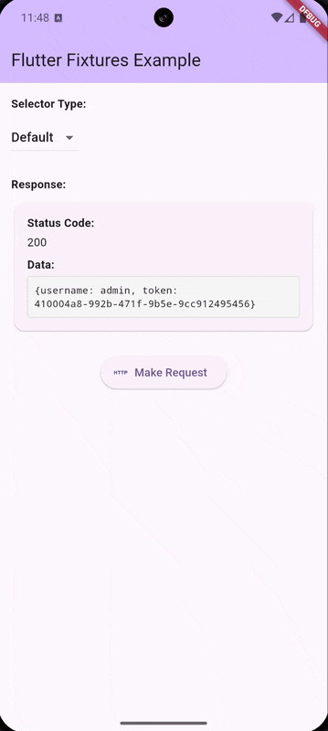

# Flutter Fixtures

A Flutter library for mocking HTTP requests and other data sources with fixture files. This library provides a flexible way to intercept requests and return mock responses, making it ideal for development, testing, and demos.

<div align="center">
  
  <p><em>Universal data mocking for Flutter applications</em></p>
</div>

## Packages

This library is designed to be modular and extensible. It consists of the following packages:

- **flutter_fixtures_core**: Core interfaces and domain models
- **flutter_fixtures_dio**: Dio HTTP client implementation
- **flutter_fixtures_ui**: UI components for fixture selection
- **flutter_fixtures**: Meta-package that combines all the above

## Features

- **Multiple Data Providers**: Support for different data providers (currently Dio, with more planned)
- **Flexible Selection Modes**: Choose how fixtures are selected (random, default, or user-selected)
- **UI Components**: Built-in UI components for user interaction
- **Extensible Architecture**: Easy to extend with new data providers and UI components
- **Modular Design**: Use only the packages you need or the combined meta-package

## Installation

### Complete Package

For the full functionality, add the meta-package to your `pubspec.yaml` file:

```yaml
dependencies:
  flutter_fixtures: ^0.1.0
```

Or use the following command:

```bash
flutter pub add flutter_fixtures
```

### Modular Installation

If you only need specific functionality, you can add individual packages:

```yaml
dependencies:
  # Core interfaces and models (required)
  flutter_fixtures_core: ^0.1.0

  # Only if you need Dio support
  flutter_fixtures_dio: ^0.1.0

  # Only if you need UI components
  flutter_fixtures_ui: ^0.1.0
```

### Custom Implementations

You can create your own implementations by depending only on the core package:

```yaml
dependencies:
  flutter_fixtures_core: ^0.1.0
```

Then implement the interfaces provided by the core package to create your custom data providers or UI components.

## Usage

### Basic Usage with Dio

```dart
import 'package:dio/dio.dart';
import 'package:flutter_fixtures/flutter_fixtures.dart';

// Create a Dio instance
final dio = Dio(BaseOptions(baseUrl: 'https://example.com'));

// Add the FixturesInterceptor
dio.interceptors.add(
  FixturesInterceptor(
    dataQuery: DioDataQuery(),
    dataSelectorView: FixturesDialogView(
      context: navigatorKey.currentContext!,
    ),
    dataSelector: DataSelectorType.random(),
    dataSelectorDelay: DataSelectorDelay.moderate, // Optional: simulate network delay
  ),
);

// Make requests as usual
final response = await dio.get('/users');
```

### Fixture Selection Modes

The library supports three fixture selection modes:

1. **Random**: Randomly selects a fixture response
   ```dart
   dataSelector: DataSelectorType.random()
   ```

2. **Default**: Always selects the fixture marked as default
   ```dart
   dataSelector: DataSelectorType.defaultValue()
   ```

3. **Pick**: Shows a dialog for the user to pick the response
   ```dart
   dataSelector: DataSelectorType.pick()
   ```

### Fixture Files

Fixture files should be placed in the `assets/fixtures` directory and included in your `pubspec.yaml`:

```yaml
flutter:
  assets:
    - assets/fixtures/
    - assets/fixtures/data/
```

Example fixture file (`assets/fixtures/GET_users.json`):

```json
{
  "description": "Users List",
  "values": [
    {
      "identifier": "Success",
      "description": "200",
      "default": true,
      "data": {"users": [{"id": 1, "name": "John"}]}
    },
    {
      "identifier": "Empty",
      "description": "200",
      "data": {"users": []}
    },
    {
      "identifier": "Error",
      "description": "500",
      "data": {"error": "Internal Server Error"}
    }
  ]
}
```

## Extensibility

Flutter Fixtures is designed to be highly extensible. You can create your own implementations for different data providers, UI components, or storage mechanisms.

### Response Delays

Simulate network latency to test loading states:

```dart
// Use predefined delays
dataSelectorDelay: DataSelectorDelay.moderate  // 500ms delay

// Or create custom delays
dataSelectorDelay: DataSelectorDelay.custom(1500)  // 1.5 second delay
```

Available options:
- `DataSelectorDelay.instant` - No delay (default)
- `DataSelectorDelay.fast` - ~100ms
- `DataSelectorDelay.moderate` - ~500ms
- `DataSelectorDelay.slow` - ~2000ms
- `DataSelectorDelay.custom(ms)` - Custom delay

### Creating a Custom Data Provider

To create a custom data provider, implement the `DataQuery` interface from the core package:

```dart
class MyCustomDataQuery implements DataQuery<MyInput, MyOutput> {
  @override
  Future<MyOutput?> find(MyInput input) async {
    // Your implementation
  }

  @override
  Future<FixtureCollection?> parse(MyOutput source) async {
    // Your implementation
  }

  @override
  Future<MyOutput?> data(FixtureDocument document) async {
    // Your implementation
  }

  @override
  Future<FixtureDocument?> select(
    FixtureCollection fixture,
    DataSelectorView? view,
    DataSelectorType selector,
  ) async {
    // You can use the FixtureSelector mixin or implement your own logic
  }
}
```

### Creating a Custom UI Component

To create a custom UI for fixture selection, implement the `DataSelectorView` interface:

```dart
class MyCustomSelectorView implements DataSelectorView {
  @override
  Future<FixtureDocument?> pick(FixtureCollection fixture) async {
    // Your custom UI implementation
  }
}
```

## Future Implementations (To-Do List)

The following implementations are planned for future releases:

### HTTP Clients
- [x] Dio
- [ ] http package
- [ ] Chopper
- [ ] Retrofit
- [ ] GraphQL

### Database Providers
- [ ] SQLite (sqflite)
- [ ] Hive
- [ ] Isar
- [ ] ObjectBox
- [ ] Realm

### UI Selectors
- [x] Dialog
- [ ] Bottom Sheet
- [ ] Dropdown
- [ ] Notification with actions
- [ ] Sidebar panel

### Other Features
- [ ] Fixture recording mode
- [ ] Fixture validation
- [ ] Response delay simulation
- [ ] Network condition simulation

## Development

### Workspace Structure

This project uses Flutter workspaces to manage multiple packages. The workspace is defined in the root `pubspec.yaml` file:

```yaml
workspace:
  - packages/flutter_fixtures_core
  - packages/flutter_fixtures_dio
  - packages/flutter_fixtures_ui
  - packages/flutter_fixtures
```

### Running Tests

To run tests for all packages:

```bash
flutter test
```

To run tests for a specific package:

```bash
flutter test packages/flutter_fixtures_core
```

## Example

See the [example](example) directory for a complete example of how to use the library.

## Contributing

Contributions are welcome! Please feel free to submit a Pull Request.

If you'd like to contribute a new implementation from the to-do list, please open an issue first to discuss the approach.

## Support

If you find this library helpful, consider supporting its development:

<a href="https://www.buymeacoffee.com/broto" target="_blank"></a>