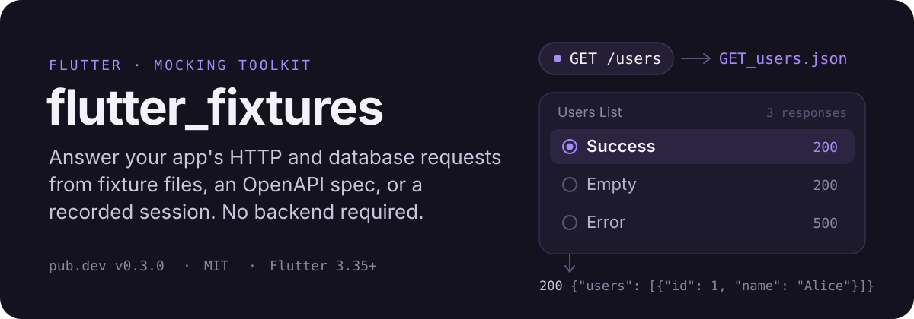
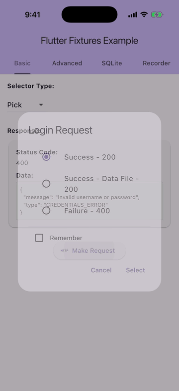
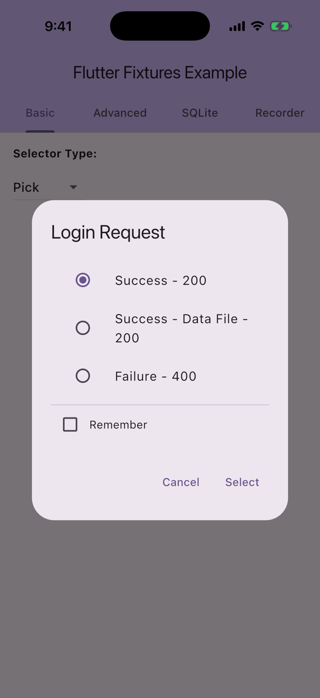
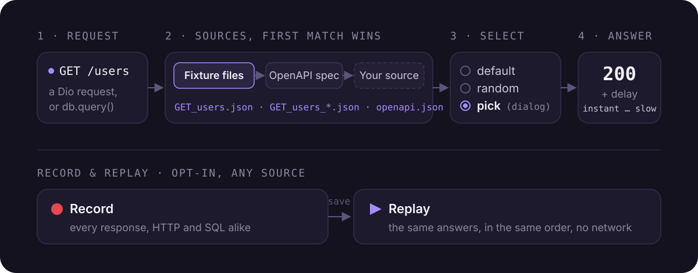
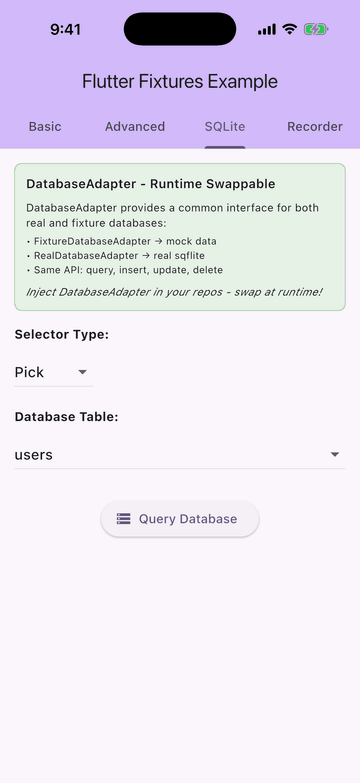
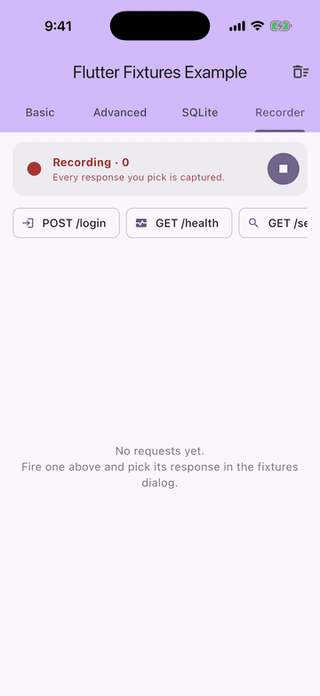
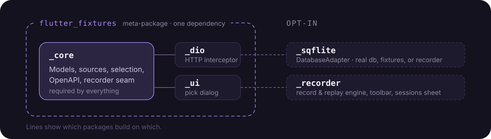

<p align="center">
  
</p>

<p align="center">
  <a href="https://github.com/brotoo25/flutter_fixtures/actions/workflows/ci.yml"></a>
  <a href="https://pub.dev/packages/flutter_fixtures"></a>
  <a href="LICENSE"></a>
</p>

Flutter Fixtures sits between your app and its data. The requests you already make through Dio or sqflite are answered from JSON fixture files instead of a live backend, and each fixture can hold several responses, so you can switch between success, empty and error states from a dialog inside the running app.

Use it to build screens before the API exists, demo without a network, and reproduce the edge cases that are hard to hit for real.

<p align="center">
  
  &nbsp;&nbsp;&nbsp;&nbsp;
  
</p>
<p align="center"><em>The example app: one request, three possible answers, chosen at runtime.</em></p>

## Quick start

**1. Add the package.** The meta-package bundles the Dio interceptor and the pick dialog.

```bash
flutter pub add flutter_fixtures
```

**2. Register the interceptor** on the Dio instance your app already uses. The pipeline is where fixtures come from, how one is chosen, and who asks. Build it once, next to the Dio instance, so remembered choices survive.

```dart
import 'package:dio/dio.dart';
import 'package:flutter/material.dart';
import 'package:flutter_fixtures/flutter_fixtures.dart';

// The dialog needs a context. Hand this key to MaterialApp(navigatorKey: ...).
final navigatorKey = GlobalKey<NavigatorState>();

final dio = Dio(BaseOptions(baseUrl: 'https://api.example.com'))
  ..interceptors.add(
    FixturesInterceptor(
      pipeline: FixturePipeline(
        source: HttpFileFixtureSource(),
        selector: DataSelectorType.pick,
        view: FixturesDialogView(
          contextProvider: () => navigatorKey.currentContext!,
        ),
      ),
    ),
  );
```

**3. Write a fixture.** Create `assets/fixtures/GET_users.json` and register the folder in `pubspec.yaml`.

```json
{
  "description": "Users List",
  "values": [
    { "identifier": "Success", "description": "200", "default": true,
      "data": { "users": [{ "id": 1, "name": "Alice" }] } },
    { "identifier": "Empty",   "description": "200", "data": { "users": [] } },
    { "identifier": "Error",   "description": "500", "data": { "error": "Internal Server Error" } }
  ]
}
```

```yaml
flutter:
  assets:
    - assets/fixtures/
```

**4. Make the request as usual.** A dialog asks which response to return. Pick *Error* and your error screen shows up.

```dart
final response = await dio.get('/users');
```

> [!TIP]
> Use `DataSelectorType.defaultValue` for automated tests and CI, and `DataSelectorType.random` to shake loose state bugs during development. The dialog is for humans.

## How it works

<p align="center">
  
</p>

**1. The request becomes a file name.** `GET /users` looks for `GET_users.json`; slashes become underscores. Query values are tried in sorted-key order: `GET_search_2_test.json` for `/search?q=test&page=2`, then wildcards `GET_search_*_*.json` or `GET_search_{{page}}_{{q}}.json`. The first file that exists wins.

**2. Sources are consulted in order.** Fixture files first, then an OpenAPI spec if you add one, then any `FixtureSource` of your own, combined with `HttpFixtureSources`. The first source that resolves the request provides the collection.

**3. One response is selected.**

| Strategy | What happens |
| --- | --- |
| `DataSelectorType.defaultValue` | Returns the entry marked `"default": true` |
| `DataSelectorType.random` | Returns any entry at random |
| `DataSelectorType.pick` | Shows a dialog and returns what you chose. Choices can be remembered per request. |

**4. The answer is delayed, then returned.** Pass `delay` to the pipeline to test loading states: the presets `DataSelectorDelay.instant` (default), `fast` (~100 ms), `moderate` (~500 ms) and `slow` (~2 s), or any `Duration`.

### Anatomy of a fixture file

| Field | Meaning |
| --- | --- |
| `description` | Title of the collection, shown in the pick dialog |
| `values[]` | The possible responses |
| `values[].identifier` | Label of one response |
| `values[].description` | Its status: the first three characters become the HTTP status code |
| `values[].default` | Marks the response used by `defaultValue` |
| `values[].data` | The inline payload |
| `values[].dataPath` | A JSON file relative to the fixtures folder, for large payloads. Use instead of `data`, and list its subfolder (for example `assets/fixtures/data/`) in `pubspec.yaml` too. |

## Beyond HTTP

### SQLite with sqflite

Code your repositories against `DatabaseAdapter`, then decide at startup whether it talks to a real database or to fixtures. Nothing in the repository changes.

```dart
import 'package:flutter_fixtures_sqflite/flutter_fixtures_sqflite.dart';

// Development: answer queries from assets/fixtures/database/
final db = FixtureDatabaseAdapter(
  pipeline: FixturePipeline(
    source: SqfliteFileFixtureSource(),
    selector: DataSelectorType.pick,
    view: FixturesDialogView.of(context),
  ),
);

// Production: the real thing
// final db = RealDatabaseAdapter(await openDatabase('app.db'));

final users = await db.query('users'); // -> query_users.json
```

Fixture files are named `{operation}_{table}.json`, so `db.insert('orders', …)` reads `insert_orders.json`. See the [sqflite package](packages/flutter_fixtures_sqflite/README.md) for the full adapter API.

<p align="center">
  
</p>

### OpenAPI specs

If your API ships an OpenAPI 3.x document, drop it in your assets and every documented response becomes a selectable fixture, labelled by status code and description, with payloads taken from the spec's examples or generated from its schema. Hand-written files still win when both exist.

```dart
FixturesInterceptor(
  pipeline: FixturePipeline(
    source: HttpFixtureSources([
      HttpFileFixtureSource(),
      OpenApiFixtureSource(specPath: 'assets/fixtures/openapi.json'),
    ]),
    selector: DataSelectorType.pick,
  ),
)
```

Details live in the [Dio package](packages/flutter_fixtures_dio/README.md#openapi-fixtures).

### Record and replay

Capture real traffic once, then replay it later in the same order, with no network at all. One recorder covers every wired source, so an HTTP call and a SQL query recorded in the same session come back together. It ships with a toolbar and a sessions sheet, and every control is also on the public API.

```dart
import 'package:flutter_fixtures_recorder/flutter_fixtures_recorder.dart';

final recorder = FixtureRecorder(
  store: sessionStoreForDirectory(() async =>
      '${(await getApplicationDocumentsDirectory()).path}/fixture_recordings'),
);

dio.interceptors.add(RecorderInterceptor(recorder: recorder));   // HTTP
final db = RecorderDatabaseAdapter(inner: realDb, recorder: recorder); // SQL

RecorderToolbar(recorder: recorder) // anywhere in your debug UI
```

Place `RecorderInterceptor` before `FixturesInterceptor` and the two chain: fixture picks are recorded too, and a replay serves them back without showing a dialog. Ordering, miss policies and custom storage are covered in the [recorder package](packages/flutter_fixtures_recorder/README.md).

<p align="center">
  
</p>
<p align="center"><em>Record two picks, save, replay: the same answers come back in order, tagged REPLAY.</em></p>

## Packages

<p align="center">
  
</p>

| Package | | What it adds |
| --- | --- | --- |
| [`flutter_fixtures`](packages/flutter_fixtures) | [](https://pub.dev/packages/flutter_fixtures) | Core + Dio + UI in one dependency |
| [`flutter_fixtures_core`](packages/flutter_fixtures_core) | [](https://pub.dev/packages/flutter_fixtures_core) | Models, fixture sources, selection flow, OpenAPI, the recorder seam |
| [`flutter_fixtures_dio`](packages/flutter_fixtures_dio) | [](https://pub.dev/packages/flutter_fixtures_dio) | `FixturesInterceptor` and `RecorderInterceptor` for Dio |
| [`flutter_fixtures_ui`](packages/flutter_fixtures_ui) | [](https://pub.dev/packages/flutter_fixtures_ui) | The pick dialog |
| [`flutter_fixtures_sqflite`](packages/flutter_fixtures_sqflite) | [](https://pub.dev/packages/flutter_fixtures_sqflite) | `DatabaseAdapter` with real, fixture and recording implementations |
| [`flutter_fixtures_recorder`](packages/flutter_fixtures_recorder) | [](https://pub.dev/packages/flutter_fixtures_recorder) | Record & replay engine, toolbar and sessions sheet |

Pick only what you need:

```yaml
dependencies:
  flutter_fixtures_core: ^0.3.0     # always
  flutter_fixtures_dio: ^0.3.0      # HTTP via Dio
  flutter_fixtures_ui: ^0.3.0       # the pick dialog
  flutter_fixtures_sqflite: ^0.3.0  # SQLite
  flutter_fixtures_recorder: ^0.3.0 # record & replay
```

To support another data source, depend on core alone: every domain shares one `FixtureSource<TRequest>` seam, file-backed sources reuse `FixtureFileSource` with their own naming convention, and a `FixturePipeline` drives it. The [core package](packages/flutter_fixtures_core/README.md) walks through a custom source, and a custom selector UI is one method:

```dart
class MySelectorView implements DataSelectorView {
  @override
  Future<FixtureChoice?> pick(FixtureCollection fixture) async {
    // show your UI; return the choice, or null if cancelled
  }
}
```

## Example app

The [example](example) has four tabs: Basic, Advanced (query wildcards and OpenAPI), SQLite, and Recorder.

```bash
cd example && flutter run
```

## Roadmap

<details>
<summary>What exists and what is planned</summary>

**HTTP clients**
- [x] Dio
- [ ] http package
- [ ] Chopper
- [ ] Retrofit
- [ ] GraphQL

**Database providers**
- [x] SQLite (sqflite)
- [ ] Hive
- [ ] Isar
- [ ] ObjectBox
- [ ] Realm

**UI selectors**
- [x] Dialog
- [ ] Bottom sheet
- [ ] Dropdown
- [ ] Notification with actions
- [ ] Sidebar panel

**Other**
- [x] OpenAPI-driven fixtures
- [x] Response delay simulation
- [x] Record & replay
- [ ] Fixture validation
- [ ] Network condition simulation

Want to take one? Open an issue first so we can agree on the approach.

</details>

## Development

<details>
<summary>Workspace setup and Melos commands</summary>

The repository is a Dart workspace managed with [Melos](https://melos.invertase.dev/).

```bash
dart pub get          # resolve the workspace
melos bootstrap       # link packages
```

| Task | Command |
| --- | --- |
| Run all tests | `melos run test` |
| Tests for changed packages only | `melos run test:changed` |
| Coverage | `melos run test:coverage` |
| Format | `melos run format` |
| Analyze | `melos run analyze` |
| Format check + analyze + test | `melos run check` |
| Same, changed packages only | `melos run check:changed` |
| Outdated dependencies | `melos run deps:outdated` |
| Clean build output | `melos run clean` |
| Publish dry run | `melos run publish:check` |

Run something in one package with `melos exec --scope="flutter_fixtures_core" -- flutter test`.

</details>

## Contributing

Contributions are welcome. Read [CONTRIBUTING.md](CONTRIBUTING.md), then open a pull request. For a new implementation from the roadmap, open an issue first to discuss the approach.

## Support

If this library saves you time, consider supporting its development.

<a href="https://www.buymeacoffee.com/broto" target="_blank"></a>

## License

MIT. See [LICENSE](LICENSE).
