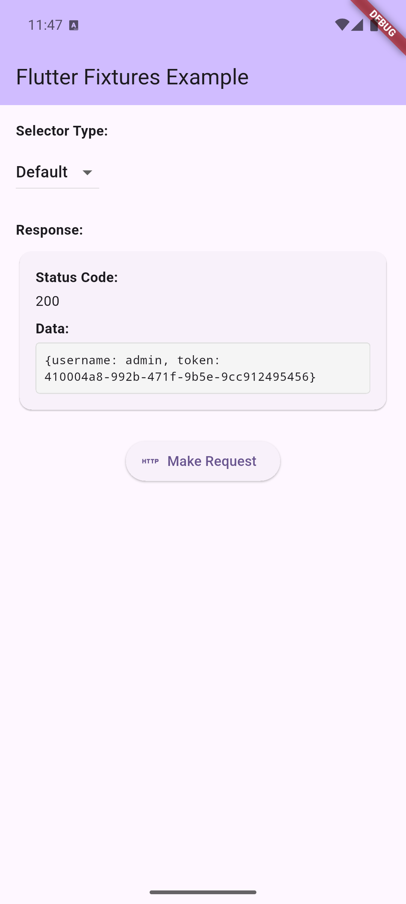
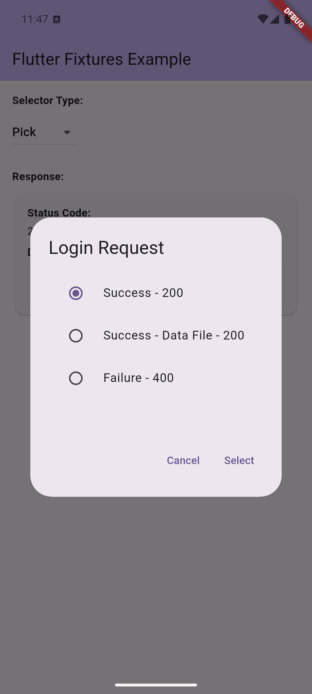

# Flutter Fixtures

[](https://pub.dev/packages/flutter_fixtures)

<div align="center">
  
  <p><em>Mock any data source with realistic fixture files</em></p>
</div>

A powerful Flutter library for mocking any data source using fixture files. Whether you're working with HTTP APIs, databases, file systems, or any other data provider, Flutter Fixtures helps you create realistic mock data for development, testing, and demos.

## ✨ Features

- 🚀 **Easy Setup** - Get started with just a few lines of code
- 📁 **File-Based Fixtures** - Organize mock data in JSON files
- 🎯 **Multiple Response Options** - Define success, error, and edge cases for any data scenario
- 🎲 **Flexible Selection** - Random, default, or user-driven fixture selection
- 🌐 **Universal Data Sources** - Works with HTTP clients, databases, file systems, and more
- 🔧 **Built-in Integrations** - Ready-to-use Dio HTTP client support
- 🎨 **UI Components** - Built-in dialogs for interactive fixture selection
- 🧩 **Extensible Architecture** - Create custom data providers for any data source

## Quick Start

### 1. Installation

```bash
flutter pub add flutter_fixtures
```

### 2. Create Fixture Files

Create fixture files for any data source. For example, `assets/fixtures/users_data.json`:

```json
{
  "description": "User Data Scenarios",
  "values": [
    {
      "identifier": "success",
      "description": "200 Success",
      "default": true,
      "data": {
        "users": [
          {"id": 1, "name": "Alice Johnson", "email": "alice@example.com"},
          {"id": 2, "name": "Bob Smith", "email": "bob@example.com"}
        ]
      }
    },
    {
      "identifier": "empty",
      "description": "200 Empty",
      "data": {"users": []}
    },
    {
      "identifier": "error",
      "description": "500 Server Error",
      "data": {"error": "Internal server error"}
    }
  ]
}
```

### 3. Update pubspec.yaml

```yaml
flutter:
  assets:
    - assets/fixtures/
```

### 4. Use with Any Data Source

#### HTTP Requests (Dio)
```dart
import 'package:dio/dio.dart';
import 'package:flutter_fixtures/flutter_fixtures.dart';

final dio = Dio(BaseOptions(baseUrl: 'https://api.example.com'));

// Add fixtures interceptor
dio.interceptors.add(
  FixturesInterceptor(
    dataQuery: DioDataQuery(),
    dataSelector: DataSelectorType.random(),
    dataSelectorDelay: DataSelectorDelay.moderate, // Optional: simulate network delay
  ),
);

// Returns mock data from fixtures!
final response = await dio.get('/users');
```

#### Custom Data Sources
```dart
// Create custom data provider for any source
class DatabaseDataQuery implements DataQuery<String, Map<String, dynamic>> {
  // Implement methods to load fixtures for database queries
}

// Use with your custom data source
final dataProvider = DatabaseDataQuery();
final mockData = await dataProvider.find('SELECT * FROM users');
```

That's it! Your app now uses realistic mock data from fixture files for any data source.

<!-- Add demo GIF here showing the app switching between different fixture responses -->

## 📖 Complete Guide

Flutter Fixtures works with any data source - HTTP APIs, databases, file systems, GraphQL endpoints, local storage, and more. The core concept is simple: define multiple data scenarios in JSON files, then let your app choose which scenario to use.

### Fixture Selection Strategies

Choose how your app selects fixture responses for any data source:

```dart
// Always use the default fixture (marked with "default": true)
dataSelector: DataSelectorType.defaultValue()

// Randomly select from available fixtures
dataSelector: DataSelectorType.random()

// Show UI dialog to let users choose
dataSelector: DataSelectorType.pick()
```

<div align="center">
  <table>
    <tr>
      <td align="center">
        
        <br><em>Default fixture selection</em>
      </td>
      <td align="center">
        
        <br><em>Interactive fixture selection</em>
      </td>
    </tr>
  </table>
</div>

### Interactive Fixture Selection

Enable users to choose fixtures through a dialog:

```dart
import 'package:flutter/material.dart';

dio.interceptors.add(
  FixturesInterceptor(
    dataQuery: DioDataQuery(),
    dataSelectorView: FixturesDialogView(context: context),
    dataSelector: DataSelectorType.pick(), // Enables dialog
  ),
);
```

<div align="center">
  
  <p><em>Interactive fixture selection dialog</em></p>
</div>

### File Naming Convention

Fixture files follow the pattern: `{HTTP_METHOD}_{PATH}.json`

| Request | Fixture File |
|---------|-------------|
| `GET /users` | `GET_users.json` |
| `POST /users` | `POST_users.json` |
| `GET /users/123` | `GET_users_123.json` |
| `PUT /users/profile` | `PUT_users_profile.json` |

**Note**: Forward slashes (`/`) in paths become underscores (`_`) in filenames.

### Advanced Fixture Structure

#### External Data Files

For large responses, store data in separate files:

```json
{
  "description": "Large dataset",
  "values": [
    {
      "identifier": "large_response",
      "description": "200 Success",
      "default": true,
      "dataPath": "data/users_large.json"
    }
  ]
}
```

#### Multiple Response Scenarios

Create comprehensive test scenarios:

```json
{
  "description": "User Authentication",
  "values": [
    {
      "identifier": "success",
      "description": "200 Login Success",
      "default": true,
      "data": {
        "token": "eyJhbGciOiJIUzI1NiIsInR5cCI6IkpXVCJ9...",
        "user": {"id": 1, "name": "Alice", "role": "admin"}
      }
    },
    {
      "identifier": "invalid_credentials",
      "description": "401 Invalid Credentials",
      "data": {
        "error": "Invalid username or password"
      }
    },
    {
      "identifier": "account_locked",
      "description": "423 Account Locked",
      "data": {
        "error": "Account temporarily locked",
        "retry_after": 300
      }
    },
    {
      "identifier": "server_error",
      "description": "500 Server Error",
      "data": {
        "error": "Internal server error"
      }
    }
  ]
}
```

### Custom Asset Directory

Organize fixtures in custom directories:

```dart
dio.interceptors.add(
  FixturesInterceptor(
    dataQuery: DioDataQuery(mockFolder: 'assets/api_mocks'),
    dataSelector: DataSelectorType.random(),
  ),
);
```

### Conditional Usage

Enable fixtures only during development:

```dart
import 'package:flutter/foundation.dart';

if (kDebugMode) {
  dio.interceptors.add(
    FixturesInterceptor(
      dataQuery: DioDataQuery(),
      dataSelector: DataSelectorType.random(),
    ),
  );
}
```

## 🛠️ Complete Example

Here's a full example showing how to integrate Flutter Fixtures with multiple data sources:

```dart
import 'package:flutter/material.dart';
import 'package:flutter/foundation.dart';
import 'package:dio/dio.dart';
import 'package:flutter_fixtures/flutter_fixtures.dart';

class DataService {
  late final Dio _dio;
  late final DatabaseDataQuery _dbQuery;
  late final FileSystemDataQuery _fsQuery;

  DataService() {
    // HTTP Client with fixtures
    _dio = Dio(BaseOptions(baseUrl: 'https://api.example.com'));
    if (kDebugMode) {
      _dio.interceptors.add(
        FixturesInterceptor(
          dataQuery: DioDataQuery(),
          dataSelector: DataSelectorType.defaultValue(),
        ),
      );
    }

    // Database queries with fixtures
    _dbQuery = DatabaseDataQuery();

    // File system operations with fixtures
    _fsQuery = FileSystemDataQuery();
  }

  // HTTP API calls
  Future<List<User>> getUsers() async {
    final response = await _dio.get('/users');
    return (response.data['users'] as List)
        .map((json) => User.fromJson(json))
        .toList();
  }

  // Database queries
  Future<List<User>> getUsersFromDatabase() async {
    final fixture = await _dbQuery.find('SELECT * FROM users');
    if (fixture != null) {
      final collection = await _dbQuery.parse(fixture);
      if (collection != null) {
        final document = await _dbQuery.select(
          collection,
          null,
          DataSelectorType.defaultValue()
        );
        if (document != null) {
          final data = await _dbQuery.data(document);
          if (data != null) {
            return (data['users'] as List)
                .map((json) => User.fromJson(json))
                .toList();
          }
        }
      }
    }
    return [];
  }

  // File system operations
  Future<List<FileInfo>> listFiles(String path) async {
    final fixture = await _fsQuery.find(path);
    if (fixture != null) {
      final collection = await _fsQuery.parse(fixture);
      if (collection != null) {
        final document = await _fsQuery.select(
          collection,
          null,
          DataSelectorType.defaultValue()
        );
        if (document != null) {
          final data = await _fsQuery.data(document);
          if (data != null && data['files'] != null) {
            return (data['files'] as List)
                .map((f) => FileInfo.fromJson(f))
                .toList();
          }
        }
      }
    }
    return [];
  }
}

class User {
  final int id;
  final String name;
  final String email;

  User({required this.id, required this.name, required this.email});

  factory User.fromJson(Map<String, dynamic> json) => User(
    id: json['id'],
    name: json['name'],
    email: json['email'],
  );

  Map<String, dynamic> toJson() => {
    'id': id,
    'name': name,
    'email': email,
  };
}

class FileInfo {
  final String name;
  final String type;
  final int size;

  FileInfo({required this.name, required this.type, required this.size});

  factory FileInfo.fromJson(Map<String, dynamic> json) => FileInfo(
    name: json['name'],
    type: json['type'],
    size: json['size'],
  );
}
```

## 📦 Package Architecture

This is a meta-package that combines three focused packages for maximum flexibility:

### flutter_fixtures_core
Core interfaces and domain models for any data source. Use this to create custom data providers for databases, file systems, GraphQL, REST APIs, or any other data source.

### flutter_fixtures_dio
Ready-to-use HTTP client implementation with Dio. Use this standalone if you only need HTTP request mocking.

### flutter_fixtures_ui
UI components for interactive fixture selection. Use this to let users choose different data scenarios during development or testing.

## 🎯 Use Cases

### Development
- **Rapid Prototyping**: Build UI without waiting for backend APIs, databases, or external services
- **Offline Development**: Work without internet connectivity or database access
- **Team Collaboration**: Share consistent mock data across team for any data source
- **Service Independence**: Develop features without depending on external services

### Testing
- **Integration Tests**: Test with predictable data scenarios from any source
- **Edge Case Testing**: Easily test error conditions and edge cases for all data types
- **Performance Testing**: Test with large datasets without database overhead
- **Unit Testing**: Mock complex data queries with simple fixture files

### Demos & Presentations
- **Consistent Demos**: Always show the same data in presentations regardless of data source
- **Showcase Features**: Demonstrate different app states with various data scenarios
- **Client Presentations**: Show realistic data without exposing real user information

<div align="center">
  
  <p><em>Switching between different fixture responses in real-time</em></p>
</div>

## 🔧 Advanced Configuration

### Simulating Response Delays

Test loading states and timeouts by simulating network latency:

```dart
dio.interceptors.add(
  FixturesInterceptor(
    dataQuery: DioDataQuery(),
    dataSelector: DataSelectorType.random(),
    dataSelectorDelay: DataSelectorDelay.moderate, // 500ms delay
  ),
);
```

**Available delays:**
- `DataSelectorDelay.instant` - No delay (default)
- `DataSelectorDelay.fast` - ~100ms (fast 4G/5G)
- `DataSelectorDelay.moderate` - ~500ms (3G)
- `DataSelectorDelay.slow` - ~2000ms (2G/EDGE)
- `DataSelectorDelay.custom(milliseconds)` - Custom delay

```dart
// Custom delay example
dataSelectorDelay: DataSelectorDelay.custom(1500) // 1.5 second delay
```

### Custom Data Providers

Create custom data providers for any data source by implementing the `DataQuery` interface:

#### Database Queries
```dart
import 'dart:math';
import 'package:flutter_fixtures_core/flutter_fixtures_core.dart';

class DatabaseDataQuery with FixtureSelector implements DataQuery<String, Map<String, dynamic>> {
  @override
  Future<Map<String, dynamic>?> find(String sqlQuery) async {
    // Load fixture based on SQL query pattern
    final fixtureName = _getFixtureNameFromQuery(sqlQuery);
    return await _loadFixtureFile('database/$fixtureName.json');
  }

  @override
  Future<FixtureCollection?> parse(Map<String, dynamic> source) async {
    // Parse database fixture format
    return FixtureCollection(
      description: source['description'],
      items: (source['values'] as List)
          .map((option) => FixtureDocument(
                identifier: option['identifier'] as String,
                description: option['description'] as String,
                defaultOption: option['default'] as bool? ?? false,
                data: option['data'],
                dataPath: option['dataPath'],
              ))
          .toList(),
    );
  }

  // select() method is provided by the FixtureSelector mixin

  @override
  Future<Map<String, dynamic>?> data(FixtureDocument document) async {
    // Return database-like response
    return document.data;
  }
}
```

#### File System Operations
```dart
class FileSystemDataQuery with FixtureSelector implements DataQuery<String, Map<String, dynamic>> {
  @override
  Future<Map<String, dynamic>?> find(String path) async {
    // Load fixture based on file path
    return await _loadFixtureFile('filesystem/${path.replaceAll('/', '_')}.json');
  }

  @override
  Future<FixtureCollection?> parse(Map<String, dynamic> source) async {
    // Parse file system fixture format
    return FixtureCollection(
      description: source['description'],
      items: (source['values'] as List)
          .map((option) => FixtureDocument(
                identifier: option['identifier'] as String,
                description: option['description'] as String,
                defaultOption: option['default'] as bool? ?? false,
                data: option['data'],
                dataPath: option['dataPath'],
              ))
          .toList(),
    );
  }

  // select() method is provided by the FixtureSelector mixin

  @override
  Future<Map<String, dynamic>?> data(FixtureDocument document) async {
    // Return file listing data
    return document.data;
  }
}
```

#### GraphQL Queries
```dart
class GraphQLDataQuery with FixtureSelector implements DataQuery<GraphQLRequest, Map<String, dynamic>> {
  @override
  Future<Map<String, dynamic>?> find(GraphQLRequest request) async {
    // Load fixture based on GraphQL operation name
    return await _loadFixtureFile('graphql/${request.operationName}.json');
  }

  @override
  Future<FixtureCollection?> parse(Map<String, dynamic> source) async {
    return FixtureCollection(
      description: source['description'],
      items: (source['values'] as List)
          .map((option) => FixtureDocument(
                identifier: option['identifier'] as String,
                description: option['description'] as String,
                defaultOption: option['default'] as bool? ?? false,
                data: option['data'],
                dataPath: option['dataPath'],
              ))
          .toList(),
    );
  }

  // select() method is provided by the FixtureSelector mixin

  @override
  Future<Map<String, dynamic>?> data(FixtureDocument document) async {
    return document.data;
  }
}
```

### Custom UI Components

Create custom fixture selection UI:

```dart
import 'package:flutter_fixtures_core/flutter_fixtures_core.dart';

class CustomFixtureSelector implements DataSelectorView {
  @override
  Future<FixtureDocument?> pick(FixtureCollection fixture) async {
    // Show your custom UI
    // Return selected fixture or null for cancellation
  }
}
```

## 🐛 Troubleshooting

### Common Issues

**Fixture file not found**
- Check file naming convention: `{METHOD}_{path}.json`
- Ensure files are in `assets/fixtures/` directory
- Verify `pubspec.yaml` includes the assets

**No fixture selected**
- Ensure at least one fixture has `"default": true`
- Check that fixture collection is not empty

**Status code parsing errors**
- First 3 characters of `description` field must be numeric
- Example: `"200 Success"`, `"404 Not Found"`

### Debug Information

Enable debug logging to see fixture loading:

```dart
dio.interceptors.add(LogInterceptor(
  requestBody: true,
  responseBody: true,
  logPrint: (object) => debugPrint(object.toString()),
));
```

Check response headers for fixture information:

```dart
final response = await dio.get('/users');
final fixturePath = response.headers.value('x-fixture-file-path');
print('Using fixture: $fixturePath');
```

## 📚 API Reference

### Core Classes

- **`FixturesInterceptor`**: Main Dio interceptor for request interception
- **`DioDataQuery`**: Data provider for loading fixtures from assets
- **`FixturesDialogView`**: UI dialog for fixture selection
- **`DataSelectorType`**: Strategies for fixture selection (Random, Default, Pick)

### Data Models

- **`FixtureCollection`**: Container for multiple fixture options
- **`FixtureDocument`**: Individual fixture response definition

For detailed API documentation, see the individual package documentation.

## 🤝 Contributing

We welcome contributions! Please see our [Contributing Guide](https://github.com/brotoo25/flutter_fixtures/blob/main/CONTRIBUTING.md) for details.

### Development Setup

1. Clone the repository
2. Run `flutter pub get` in the root directory
3. Run tests: `flutter test`
4. Run the example app: `cd example && flutter run`

## 📄 License

This project is licensed under the MIT License - see the [LICENSE](https://github.com/brotoo25/flutter_fixtures/blob/main/LICENSE) file for details.

## 🔗 Links

- [GitHub Repository](https://github.com/brotoo25/flutter_fixtures)
- [Issue Tracker](https://github.com/brotoo25/flutter_fixtures/issues)
- [Pub.dev Package](https://pub.dev/packages/flutter_fixtures)
- [API Documentation](https://pub.dev/documentation/flutter_fixtures/latest/)
