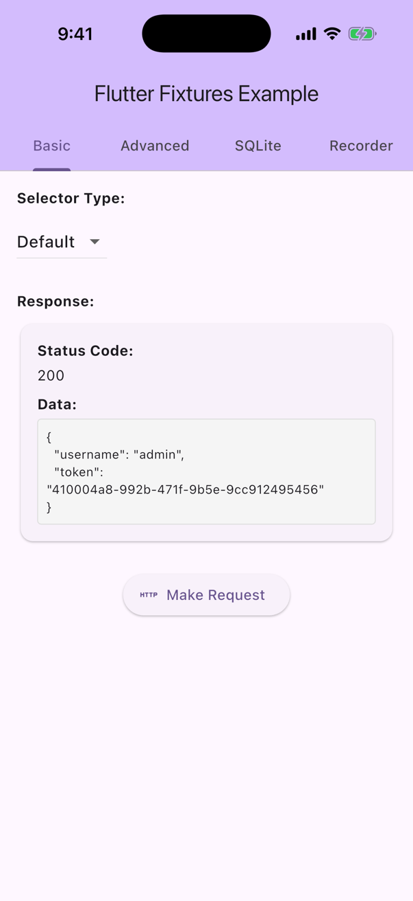

# Flutter Fixtures Dio

[](https://pub.dev/packages/flutter_fixtures_dio)

<div align="center">
  
  <p><em>Seamless Dio request interception with fixture files</em></p>
</div>

Dio HTTP client implementation for the Flutter Fixtures library. This package provides a seamless way to intercept Dio requests and return mock responses from fixture files.

## Quick Start

Add the dependency to your `pubspec.yaml`:

```yaml
dependencies:
  flutter_fixtures_dio: ^0.3.0
  dio: ^5.4.3+1
```

Set up the interceptor:

```dart
import 'package:dio/dio.dart';
import 'package:flutter_fixtures_dio/flutter_fixtures_dio.dart';

final dio = Dio();
dio.interceptors.add(
  FixturesInterceptor(
    pipeline: FixturePipeline(
      source: HttpFileFixtureSource(),
      selector: DataSelectorType.random,
    ),
  ),
);
```

That's it! Your Dio requests will now return mock responses from fixture files.

<div align="center">
  
  <p><em>Dio interceptor returning mock responses from fixture files</em></p>
</div>

## What's Included

This package provides one main component:

### FixturesInterceptor
A Dio interceptor that automatically intercepts HTTP requests and returns mock responses. It consults an ordered list of `HttpFixtureSource`s — fixture files by default, an OpenAPI spec or your own source if you add one.

## Installation

1. Add the package to your `pubspec.yaml`:

```yaml
dependencies:
  flutter_fixtures_dio: ^0.3.0
  dio: ^5.4.3+1
```

2. Create your fixture files in `assets/fixtures/` directory

3. Update your `pubspec.yaml` to include the assets:

```yaml
flutter:
  assets:
    - assets/fixtures/
```

4. Run `flutter pub get`

## Basic Usage

### Simple Setup

The most basic setup requires just a few lines of code:

```dart
import 'package:dio/dio.dart';
import 'package:flutter_fixtures_dio/flutter_fixtures_dio.dart';

final dio = Dio(BaseOptions(baseUrl: 'https://api.example.com'));

// Add the fixtures interceptor
dio.interceptors.add(
  FixturesInterceptor(
    pipeline: FixturePipeline(
      source: HttpFileFixtureSource(),
      selector: DataSelectorType.random,
      delay: DataSelectorDelay.instant,
    ),
  ),
);

// Use Dio as normal - requests will return mock data
final response = await dio.get('/users');
print(response.data); // Mock data from fixture file
```

### Fixture Selection Strategies

Choose how fixtures are selected:

```dart
// Always use the default fixture (marked with "default": true)
selector: DataSelectorType.defaultValue
// Randomly select from available fixtures
selector: DataSelectorType.random
// Let user pick through UI (requires flutter_fixtures_ui package)
selector: DataSelectorType.pick
```

<div align="center">
  <table>
    <tr>
      <td align="center">
        
        <br><em>Automatic default selection</em>
      </td>
      <td align="center">
        
        <br><em>User-driven selection</em>
      </td>
    </tr>
  </table>
</div>

### Custom Asset Directory

By default, fixtures are loaded from `assets/fixtures/`. You can customize this:

```dart
dio.interceptors.add(
  FixturesInterceptor(
    pipeline: FixturePipeline(
      source: HttpFileFixtureSource(mockFolder: 'assets/my_mocks'),
      selector: DataSelectorType.random,
    ),
  ),
);
```

## Fixture Files

### File Naming Convention

Fixture files should be named using the pattern: `{HTTP_METHOD}_{PATH}.json`

Examples:
- `GET_users.json` → matches `GET /users`
- `POST_users.json` → matches `POST /users`
- `GET_users_123.json` → matches `GET /users/123`
- `PUT_users_profile.json` → matches `PUT /users/profile`

**Note**: Forward slashes (`/`) in paths are replaced with underscores (`_`) in filenames.

### Query Parameter Matching

For requests with query parameters, candidates are tried in this priority
order (query values are ordered by **sorted key name**, not URL order):

1. **Exact, ignoring query params**: `GET_search.json`
2. **Values appended**: `GET_search_2_test.json` for `GET /search?q=test&page=2`
3. **Literal `*` per value**: `GET_search_*_*.json`
4. **`{{key}}` per sorted key**: `GET_search_{{page}}_{{q}}.json`

The `*` and `{{key}}` forms are literal file names, not globs — they match
any request with the same number of non-empty query values. The first
candidate that exists wins.

### Fixture File Structure

Each fixture file contains multiple response options:

```json
{
  "description": "User API responses",
  "values": [
    {
      "identifier": "success",
      "description": "200 Success",
      "default": true,
      "data": {
        "users": [
          {"id": 1, "name": "Alice Johnson", "email": "alice@example.com"},
          {"id": 2, "name": "Bob Smith", "email": "bob@example.com"}
        ]
      }
    },
    {
      "identifier": "empty",
      "description": "200 Empty List",
      "data": {
        "users": []
      }
    },
    {
      "identifier": "server_error",
      "description": "500 Server Error",
      "data": {
        "error": "Internal server error",
        "message": "Something went wrong"
      }
    }
  ]
}
```

### Field Descriptions

- **`description`**: Human-readable description of the fixture collection
- **`values`**: Array of possible responses
  - **`identifier`**: Unique identifier for this response option
  - **`description`**: Response description (first 3 characters used as HTTP status code)
  - **`default`**: Boolean indicating if this is the default response
  - **`data`**: The actual response data that will be returned
  - **`dataPath`**: (Optional) Path to external JSON file containing response data

### External Data Files

For large responses, you can store data in separate files:

```json
{
  "description": "Large user dataset",
  "values": [
    {
      "identifier": "large_dataset",
      "description": "200 Success",
      "default": true,
      "dataPath": "data/users_large.json"
    }
  ]
}
```

The `dataPath` is relative to your fixture folder (e.g., `assets/fixtures/data/users_large.json`).

## OpenAPI Fixtures

If your API has an OpenAPI 3.x spec, you don't have to hand-write a fixture
file per endpoint. Drop the spec's JSON in your assets and add an
`OpenApiFixtureSource` to the interceptor's sources:

```dart
dio.interceptors.add(
  FixturesInterceptor(
    pipeline: FixturePipeline(
      source: HttpFixtureSources([
      HttpFileFixtureSource(),
      OpenApiFixtureSource(specPath: 'assets/fixtures/openapi.json'),
    ]),
      selector: DataSelectorType.pick,
    ),
  ),
);
```

Remember to include the file in your `pubspec.yaml` assets (the default
`assets/fixtures/` entry already covers the path above).

For any request with no matching fixture file, the operation is looked up in
the spec (path templates like `/users/{id}` and `servers` base paths are
handled) and its documentation becomes the collection:

- The operation's `summary` (or `operationId`) names the collection.
- Each response becomes a selectable document, described as
  `"<status> <response description>"` — e.g. `404 Product not found`.
- Payloads come from the response's named `examples` (one document each),
  its inline `example`, the schema's `example`, or — when the spec carries
  no example at all — sample data generated from the schema
  (`$ref`, `allOf`, `oneOf`/`anyOf`, `enum`, and string `format`s are honoured).
- Status ranges like `2XX` map to their first code, and `default` maps to `500`.

Sources are consulted in list order and the first one that resolves wins:
with the list above, hand-written fixture files beat spec-derived ones, so
you can start from the spec and override individual endpoints with richer
fixtures as you need them. Any `HttpFixtureSource` implementation can join
the list — files and OpenAPI are the built-in ones, and you can plug in
your own for other API description formats.

## Advanced Usage

### Response Headers

The interceptor automatically adds helpful headers to responses:

- **`x-fixture-file-path`**: Path to the fixture file used (when `dataPath` is specified)

```dart
final response = await dio.get('/users');
final fixturePath = response.headers.value('x-fixture-file-path');
print('Response from: $fixturePath');
```

### Error Handling

The interceptor handles various error scenarios:

- **No fixture found**: Returns `DioException` with "No fixture found for request"
- **Empty fixture collection**: Returns `DioException` with "No fixture options found for request"
- **No fixture selected**: Returns `DioException` with "No fixture selected for request"
- **Processing errors**: Returns `DioException` with detailed error information

### Integration with UI Components

For interactive fixture selection, combine with the `flutter_fixtures_ui` package:

```dart
import 'package:flutter_fixtures_ui/flutter_fixtures_ui.dart';

dio.interceptors.add(
  FixturesInterceptor(
    pipeline: FixturePipeline(
      source: HttpFileFixtureSource(),
      selector: DataSelectorType.pick,
      view: FixturesDialogView.of(context),
    ),
  ),
);
```

This will show a dialog allowing users to choose which fixture response to return.

<div align="center">
  
  <p><em>Interactive fixture selection with UI dialog</em></p>
</div>

## Examples

### Complete Example

```dart
import 'package:flutter/material.dart';
import 'package:dio/dio.dart';
import 'package:flutter_fixtures_dio/flutter_fixtures_dio.dart';

class ApiService {
  late final Dio _dio;

  ApiService() {
    _dio = Dio(BaseOptions(baseUrl: 'https://api.example.com'));

    // Add fixtures interceptor for development/testing
    _dio.interceptors.add(
      FixturesInterceptor(
        pipeline: FixturePipeline(
          source: HttpFileFixtureSource(),
          selector: DataSelectorType.defaultValue,
        ),
      ),
    );
  }

  Future<List<User>> getUsers() async {
    final response = await _dio.get('/users');
    return (response.data['users'] as List)
        .map((json) => User.fromJson(json))
        .toList();
  }

  Future<User> createUser(User user) async {
    final response = await _dio.post('/users', data: user.toJson());
    return User.fromJson(response.data);
  }
}
```

## API Reference

### FixturesInterceptor

The main interceptor class that handles request interception.

**Constructor Parameters:**
- `sources` (optional): Ordered `HttpFixtureSource` list consulted per request; the first that resolves wins and provides the response payload (default: a single `HttpFileFixtureSource`)
- `mockFolder` (optional): Asset directory for the default file source (default: `'assets/fixtures'`); ignored when `sources` is given
- `assetLoader` (optional): Seam for reading fixture assets used by the default file source (default: root asset bundle); ignored when `sources` is given
- `pipeline` (required): The `FixturePipeline<HttpFixtureRequest>` every request is served through. Its constructor is the whole configuration surface: `source` (an `HttpFixtureSource`, e.g. `HttpFileFixtureSource()` or `HttpFixtureSources([...])`), `selector` (`DataSelectorType`), `view` (optional `DataSelectorView` for user-driven selection), and `delay` (optional `Duration`, default `DataSelectorDelay.instant`). Build the pipeline once next to the Dio instance: remembered choices live in it. A miss rejects with a `DioException` whose `error` is the `FixtureMiss` (`FixtureNotFound`, `FixtureEmpty`, `FixtureCancelled`).

## Related Packages

- **[flutter_fixtures](https://pub.dev/packages/flutter_fixtures)**: Complete Flutter Fixtures library with all components
- **[flutter_fixtures_core](https://pub.dev/packages/flutter_fixtures_core)**: Core interfaces and models
- **[flutter_fixtures_ui](https://pub.dev/packages/flutter_fixtures_ui)**: UI components for fixture selection

## Contributing

Contributions are welcome! Please read our [contributing guide](https://github.com/brotoo25/flutter_fixtures/blob/main/CONTRIBUTING.md) and submit pull requests to our [GitHub repository](https://github.com/brotoo25/flutter_fixtures).

## License

This project is licensed under the MIT License - see the [LICENSE](https://github.com/brotoo25/flutter_fixtures/blob/main/LICENSE) file for details.

## Where did this response come from?

Both interceptors stamp served responses, and `ResponseOrigin.of` reads the
stamp once so apps and logging never parse headers themselves:

```dart
switch (ResponseOrigin.of(response)) {
  case FixtureOrigin(:final document, :final filePath): // served fixture
  case ReplayOrigin(:final recordedAt):                  // replayed recording
  case LiveOrigin():                                     // network or elsewhere
}
```

A request that produced no response carries its case in
`DioException.error`: a `FixtureMiss` (`FixtureNotFound`, `FixtureEmpty`,
`FixtureCancelled`) or a replay rejection.

## Record & replay

This package also ships `RecorderInterceptor`, the Dio adapter for the
Flutter Fixtures record & replay module: capture real HTTP traffic while
exercising the app, then replay it later in recorded order — without
touching the network. The engine and UI tools live in
[`flutter_fixtures_recorder`](../flutter_fixtures_recorder); this
interceptor only talks to the thin `TrafficRecorder` seam in core.

```dart
final recorder = FixtureRecorder(store: MemoryRecordingSessionStore());
dio.interceptors.add(RecorderInterceptor(recorder: recorder));
```

Composed with `FixturesInterceptor` (recorder first), the two features
chain: fixture responses — including ones picked by hand through the
dialog — are recorded into the session, and replaying serves the same
choices back in order with no dialogs and no fixture pipeline involved:

```dart
dio.interceptors
  ..add(RecorderInterceptor(recorder: recorder))
  ..add(FixturesInterceptor(
    pipeline: FixturePipeline(
      source: HttpFileFixtureSource(),
      selector: DataSelectorType.pick,
      view: FixturesDialogView(contextProvider: () => context),
    ),
  ));
```

Replayed responses behave like the live ones did: they flow through the
response-interceptor chain, an error status raises `DioException.badResponse`
as the original did, and each is stamped so `ResponseOrigin.of` reports a
`ReplayOrigin`.

See the recorder package README for sessions, storage, ordering
semantics, and the built-in UI tools.
