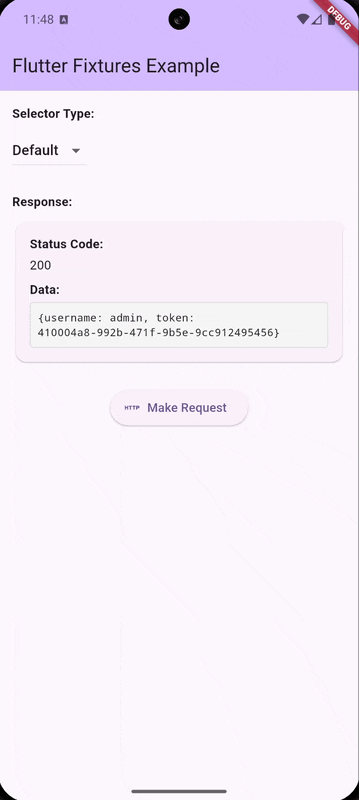
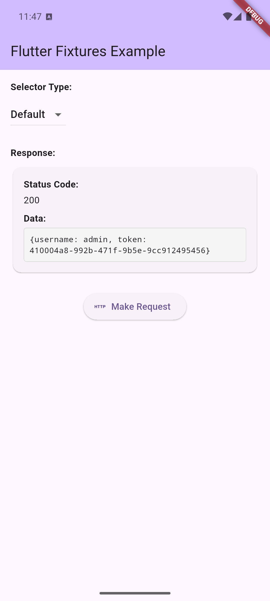

# Flutter Fixtures Dio

[](https://pub.dev/packages/flutter_fixtures_dio)

<div align="center">
  
  <p><em>Seamless Dio request interception with fixture files</em></p>
</div>

Dio HTTP client implementation for the Flutter Fixtures library. This package provides a seamless way to intercept Dio requests and return mock responses from fixture files.

## Quick Start

Add the dependency to your `pubspec.yaml`:

```yaml
dependencies:
  flutter_fixtures_dio: ^0.1.0
  dio: ^5.4.3+1
```

Set up the interceptor:

```dart
import 'package:dio/dio.dart';
import 'package:flutter_fixtures_dio/flutter_fixtures_dio.dart';

final dio = Dio();
dio.interceptors.add(
  FixturesInterceptor(
    dataQuery: DioDataQuery(),
    dataSelector: DataSelectorType.random(),
  ),
);
```

That's it! Your Dio requests will now return mock responses from fixture files.

<div align="center">
  
  <p><em>Dio interceptor returning mock responses from fixture files</em></p>
</div>

## What's Included

This package provides two main components:

### FixturesInterceptor
A Dio interceptor that automatically intercepts HTTP requests and returns mock responses based on fixture files.

### DioDataQuery
A data provider that loads fixture files from your app's assets and parses them into structured responses.

## Installation

1. Add the package to your `pubspec.yaml`:

```yaml
dependencies:
  flutter_fixtures_dio: ^0.1.0
  dio: ^5.4.3+1
```

2. Create your fixture files in `assets/fixtures/` directory

3. Update your `pubspec.yaml` to include the assets:

```yaml
flutter:
  assets:
    - assets/fixtures/
```

4. Run `flutter pub get`

## Basic Usage

### Simple Setup

The most basic setup requires just a few lines of code:

```dart
import 'package:dio/dio.dart';
import 'package:flutter_fixtures_dio/flutter_fixtures_dio.dart';

final dio = Dio(BaseOptions(baseUrl: 'https://api.example.com'));

// Add the fixtures interceptor
dio.interceptors.add(
  FixturesInterceptor(
    dataQuery: DioDataQuery(),
    dataSelector: DataSelectorType.random(), // Randomly select fixtures
    dataSelectorDelay: DataSelectorDelay.instant, // Optional: simulate network delay
  ),
);

// Use Dio as normal - requests will return mock data
final response = await dio.get('/users');
print(response.data); // Mock data from fixture file
```

### Fixture Selection Strategies

Choose how fixtures are selected:

```dart
// Always use the default fixture (marked with "default": true)
dataSelector: DataSelectorType.defaultValue()

// Randomly select from available fixtures
dataSelector: DataSelectorType.random()

// Let user pick through UI (requires flutter_fixtures_ui package)
dataSelector: DataSelectorType.pick()
```

<div align="center">
  <table>
    <tr>
      <td align="center">
        
        <br><em>Automatic default selection</em>
      </td>
      <td align="center">
        
        <br><em>User-driven selection</em>
      </td>
    </tr>
  </table>
</div>

### Custom Asset Directory

By default, fixtures are loaded from `assets/fixtures/`. You can customize this:

```dart
dio.interceptors.add(
  FixturesInterceptor(
    dataQuery: DioDataQuery(mockFolder: 'assets/my_mocks'),
    dataSelector: DataSelectorType.random(),
  ),
);
```

## Fixture Files

### File Naming Convention

Fixture files should be named using the pattern: `{HTTP_METHOD}_{PATH}.json`

Examples:
- `GET_users.json` → matches `GET /users`
- `POST_users.json` → matches `POST /users`
- `GET_users_123.json` → matches `GET /users/123`
- `PUT_users_profile.json` → matches `PUT /users/profile`

**Note**: Forward slashes (`/`) in paths are replaced with underscores (`_`) in filenames.

### Fixture File Structure

Each fixture file contains multiple response options:

```json
{
  "description": "User API responses",
  "values": [
    {
      "identifier": "success",
      "description": "200 Success",
      "default": true,
      "data": {
        "users": [
          {"id": 1, "name": "Alice Johnson", "email": "alice@example.com"},
          {"id": 2, "name": "Bob Smith", "email": "bob@example.com"}
        ]
      }
    },
    {
      "identifier": "empty",
      "description": "200 Empty List",
      "data": {
        "users": []
      }
    },
    {
      "identifier": "server_error",
      "description": "500 Server Error",
      "data": {
        "error": "Internal server error",
        "message": "Something went wrong"
      }
    }
  ]
}
```

### Field Descriptions

- **`description`**: Human-readable description of the fixture collection
- **`values`**: Array of possible responses
  - **`identifier`**: Unique identifier for this response option
  - **`description`**: Response description (first 3 characters used as HTTP status code)
  - **`default`**: Boolean indicating if this is the default response
  - **`data`**: The actual response data that will be returned
  - **`dataPath`**: (Optional) Path to external JSON file containing response data

### External Data Files

For large responses, you can store data in separate files:

```json
{
  "description": "Large user dataset",
  "values": [
    {
      "identifier": "large_dataset",
      "description": "200 Success",
      "default": true,
      "dataPath": "data/users_large.json"
    }
  ]
}
```

The `dataPath` is relative to your fixture folder (e.g., `assets/fixtures/data/users_large.json`).

## Advanced Usage

### Response Headers

The interceptor automatically adds helpful headers to responses:

- **`x-fixture-file-path`**: Path to the fixture file used (when `dataPath` is specified)

```dart
final response = await dio.get('/users');
final fixturePath = response.headers.value('x-fixture-file-path');
print('Response from: $fixturePath');
```

### Error Handling

The interceptor handles various error scenarios:

- **No fixture found**: Returns `DioException` with "No fixture found for request"
- **Empty fixture collection**: Returns `DioException` with "No fixture options found for request"
- **No fixture selected**: Returns `DioException` with "No fixture selected for request"
- **Processing errors**: Returns `DioException` with detailed error information

### Integration with UI Components

For interactive fixture selection, combine with the `flutter_fixtures_ui` package:

```dart
import 'package:flutter_fixtures_ui/flutter_fixtures_ui.dart';

dio.interceptors.add(
  FixturesInterceptor(
    dataQuery: DioDataQuery(),
    dataSelectorView: FixturesDialogView(context: context),
    dataSelector: DataSelectorType.pick(), // Enables UI selection
  ),
);
```

This will show a dialog allowing users to choose which fixture response to return.

<div align="center">
  
  <p><em>Interactive fixture selection with UI dialog</em></p>
</div>

## Examples

### Complete Example

```dart
import 'package:flutter/material.dart';
import 'package:dio/dio.dart';
import 'package:flutter_fixtures_dio/flutter_fixtures_dio.dart';

class ApiService {
  late final Dio _dio;

  ApiService() {
    _dio = Dio(BaseOptions(baseUrl: 'https://api.example.com'));

    // Add fixtures interceptor for development/testing
    _dio.interceptors.add(
      FixturesInterceptor(
        dataQuery: DioDataQuery(),
        dataSelector: DataSelectorType.defaultValue(),
      ),
    );
  }

  Future<List<User>> getUsers() async {
    final response = await _dio.get('/users');
    return (response.data['users'] as List)
        .map((json) => User.fromJson(json))
        .toList();
  }

  Future<User> createUser(User user) async {
    final response = await _dio.post('/users', data: user.toJson());
    return User.fromJson(response.data);
  }
}
```

## API Reference

### FixturesInterceptor

The main interceptor class that handles request interception.

**Constructor Parameters:**
- `dataQuery` (required): Implementation of `DataQuery` for loading fixtures
- `dataSelector` (required): Strategy for selecting which fixture to return
- `dataSelectorView` (optional): UI component for user-driven fixture selection
- `dataSelectorDelay` (optional): Delay to apply when selecting fixtures (default: `DataSelectorDelay.instant`)

### DioDataQuery

Data provider that loads and parses fixture files from app assets.

**Constructor Parameters:**
- `mockFolder` (optional): Asset directory containing fixture files (default: `'assets/fixtures'`)

**Methods:**
- `find(RequestOptions)`: Locates fixture file for the request
- `parse(Map<String, dynamic>)`: Parses fixture file into collection
- `select(...)`: Selects specific fixture based on strategy
- `data(FixtureDocument)`: Retrieves response data for selected fixture

## Related Packages

- **[flutter_fixtures](https://pub.dev/packages/flutter_fixtures)**: Complete Flutter Fixtures library with all components
- **[flutter_fixtures_core](https://pub.dev/packages/flutter_fixtures_core)**: Core interfaces and models
- **[flutter_fixtures_ui](https://pub.dev/packages/flutter_fixtures_ui)**: UI components for fixture selection

## Contributing

Contributions are welcome! Please read our [contributing guide](https://github.com/brotoo25/flutter_fixtures/blob/main/CONTRIBUTING.md) and submit pull requests to our [GitHub repository](https://github.com/brotoo25/flutter_fixtures).

## License

This project is licensed under the MIT License - see the [LICENSE](https://github.com/brotoo25/flutter_fixtures/blob/main/LICENSE) file for details.
