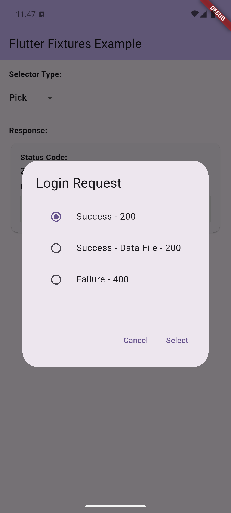

# Flutter Fixtures UI

[](https://pub.dev/packages/flutter_fixtures_ui)

<div align="center">
  
  <p><em>Interactive fixture selection with beautiful Material Design</em></p>
</div>

Pre-built UI components for interactive fixture selection in the Flutter Fixtures library. This package provides ready-to-use dialogs and components that let users choose which fixture response to return.

## 🎯 Purpose

This package provides UI components that implement the `DataSelectorView` interface from `flutter_fixtures_core`. Use this package when you want:

- Interactive fixture selection during development
- User-driven testing scenarios
- Demo modes where you can switch between different data states

## 📦 What's Included

### FixturesDialogView
A Material Design dialog that displays fixture options in a clean, selectable list.

## 🚀 Quick Start

Add to your `pubspec.yaml`:

```yaml
dependencies:
  flutter_fixtures_ui: ^0.1.0
  flutter_fixtures_dio: ^0.1.0
  flutter_fixtures_core: ^0.1.0
```

## 🎨 Dialog Features

The `FixturesDialogView` provides:

- **Clean Material Design**: Follows Flutter's design guidelines
- **Fixture Information**: Shows identifier and description for each option
- **Default Selection**: Automatically selects the default fixture
- **Cancellation**: Users can cancel without selecting
- **Scrollable**: Handles long lists of fixtures gracefully

<div align="center">
  
  <p><em>Clean Material Design fixture selection dialog</em></p>
</div>

## 🛠️ Customization

### Dialog Styling

The dialog uses your app's theme automatically, but you can customize it by wrapping in a `Theme`:

```dart
Theme(
  data: Theme.of(context).copyWith(
    dialogTheme: DialogTheme(
      shape: RoundedRectangleBorder(
        borderRadius: BorderRadius.circular(16),
      ),
    ),
  ),
  child: FixturesDialogView(context: context),
)
```

### Custom Dialog Content

For more control, you can extend `FixturesDialogView` or create your own implementation:

```dart
class CustomFixturesDialog extends FixturesDialogView {
  CustomFixturesDialog({required BuildContext context}) : super(context: context);

  @override
  Future<FixtureDocument?> pick(FixtureCollection fixture) async {
    return showDialog<FixtureDocument>(
      context: context,
      builder: (context) => AlertDialog(
        title: Text(fixture.description),
        content: Column(
          mainAxisSize: MainAxisSize.min,
          children: fixture.items.map((item) =>
            Card(
              child: ListTile(
                leading: Icon(item.defaultOption ? Icons.star : Icons.circle_outlined),
                title: Text(item.identifier),
                subtitle: Text(item.description),
                onTap: () => Navigator.of(context).pop(item),
              ),
            )
          ).toList(),
        ),
        actions: [
          TextButton(
            onPressed: () => Navigator.of(context).pop(),
            child: Text('Cancel'),
          ),
        ],
      ),
    );
  }
}
```

## 🔧 Creating Custom UI Components

Implement the `DataSelectorView` interface to create completely custom UI:

```dart
import 'package:flutter_fixtures_core/flutter_fixtures_core.dart';

class BottomSheetSelector implements DataSelectorView {
  final BuildContext context;

  BottomSheetSelector({required this.context});

  @override
  Future<FixtureDocument?> pick(FixtureCollection fixture) async {
    return showModalBottomSheet<FixtureDocument>(
      context: context,
      isScrollControlled: true,
      builder: (context) => DraggableScrollableSheet(
        initialChildSize: 0.5,
        builder: (context, scrollController) => Container(
          padding: EdgeInsets.all(16),
          child: Column(
            children: [
              Text(
                fixture.description,
                style: Theme.of(context).textTheme.headlineSmall,
              ),
              SizedBox(height: 16),
              Expanded(
                child: ListView.builder(
                  controller: scrollController,
                  itemCount: fixture.items.length,
                  itemBuilder: (context, index) {
                    final item = fixture.items[index];
                    return Card(
                      child: ListTile(
                        title: Text(item.identifier),
                        subtitle: Text(item.description),
                        trailing: item.defaultOption
                          ? Icon(Icons.star, color: Colors.amber)
                          : null,
                        onTap: () => Navigator.of(context).pop(item),
                      ),
                    );
                  },
                ),
              ),
            ],
          ),
        ),
      ),
    );
  }
}
```

## 📋 API Reference

### FixturesDialogView

The main dialog component for fixture selection.

**Constructor:**
```dart
FixturesDialogView({required BuildContext context})
```

**Methods:**
```dart
Future<FixtureDocument?> pick(FixtureCollection fixture)
```

Shows a dialog with the fixture options and returns the selected fixture, or `null` if cancelled.

## 🔗 Integration

This package works seamlessly with:

- **[flutter_fixtures_core](https://pub.dev/packages/flutter_fixtures_core)**: Provides the base interfaces
- **[flutter_fixtures_dio](https://pub.dev/packages/flutter_fixtures_dio)**: Dio HTTP client integration
- **[flutter_fixtures](https://pub.dev/packages/flutter_fixtures)**: Complete library bundle

## 🤝 Contributing

Contributions are welcome! Please read our [contributing guide](https://github.com/brotoo25/flutter_fixtures/blob/main/CONTRIBUTING.md).

## 📄 License

MIT License - see the [LICENSE](https://github.com/brotoo25/flutter_fixtures/blob/main/LICENSE) file for details.
